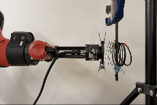
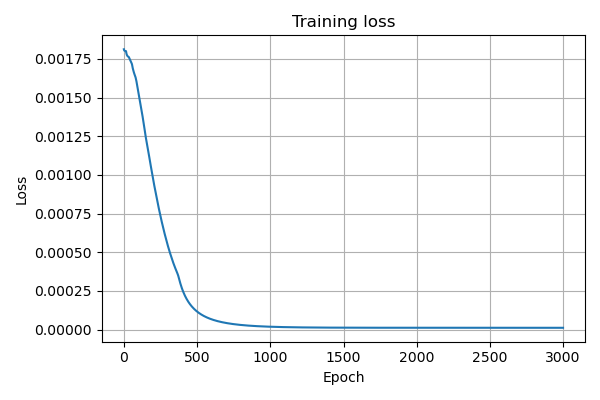
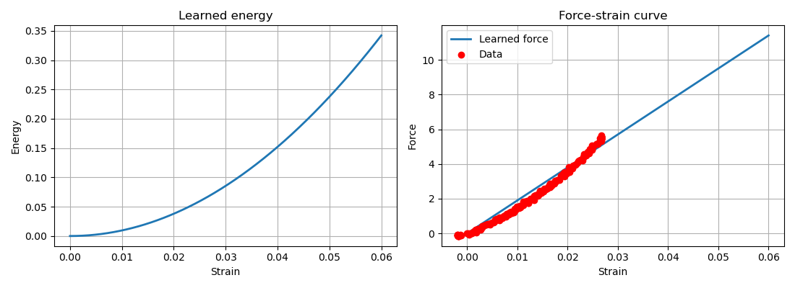
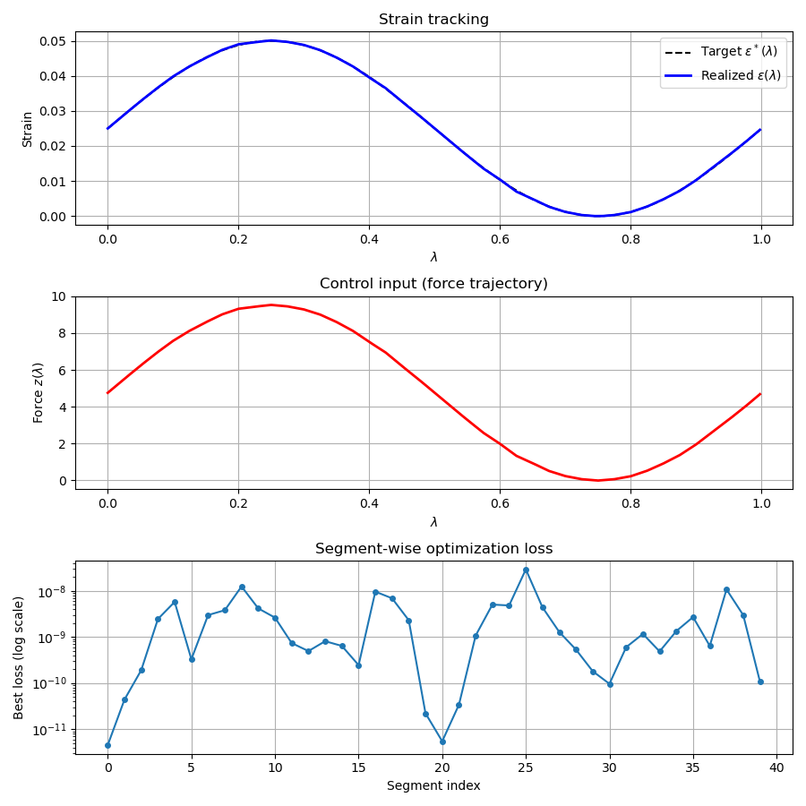

## [Supplementary materials for manuscript ''Neural Control: Adjoint Learning Through Equilibrium Constraints'']()

This repository contains supplementary materials for the anonymous manuscript **“Neural Control: Adjoint Learning Through Equilibrium Constraints”**. 
The supplementary materials are organized as follows:
- **Validation on a learned DEQ model**, including data collection videos and result plots.
- **iCEM baseline results**, including comparison plots and tables.
- **Videos of the robotic experiments** shown in Fig. 5.

# Anonymous Supplementary Materials for ICML Rebuttal

This anonymous website provides supplementary materials referenced in the rebuttal for the submission **“Neural Control: Adjoint Learning Through Equilibrium Constraints.”**

The materials are organized to directly address reviewer questions regarding:
- validation on a learned DEQ-style equilibrium model,
- comparison with a stronger modern derivative-free baseline (iCEM),
- and access to supplementary videos and plots.

All contents are provided in anonymized form for review purposes only.

---

## 1. Validation on a learned DEQ-style equilibrium model

This section provides supplementary materials for the additional validation experiment based on a learned DEQ-style equilibrium model.

### Overview
We collect force–strain measurements from a slinky under one-end actuation and use these data to train a neural energy model \(E_\theta(\varepsilon)\). The resulting equilibrium state \(\varepsilon^\star\) under control input \(z\) is defined implicitly by

$$G(\varepsilon^\star, z; \theta) = F_\theta(\varepsilon^\star) - z = 0,
\qquad
F_\theta = \partial E_\theta / \partial \varepsilon.
$$

The forward equilibrium is solved to convergence, and training uses implicit differentiation / IFT without unrolling, in the same spirit as DEQ methods.

After training, this learned implicit model is frozen and used as the forward model for Neural Control, which optimizes a force trajectory \(z(\lambda)\) so that the resulting equilibrium strain trajectory tracks the target

$$
\varepsilon^*(\lambda) = 0.05\sin(2\pi\lambda) + 0.05, \qquad \lambda \in [0,1].
$$

This experiment is intended to provide a concrete validation on a learned implicit / DEQ-style model beyond the original mechanics simulator.

### Data collection
A video of the force–strain data collection process is shown below.

  
   
  <em>Figure 1. Training data collection for the force–strain dataset of a slinky through robotic manipulation.</em>

Original video: [DEQ_relevant/video/data_collection.mp4](DEQ_relevant/video/data_collection.mp4)

### DEQ model training
The training curve of the learned DEQ-style equilibrium model is shown below.

  
   
  <em>Figure 2. Training curve of the DEQ-style equilibrium model.</em>

### DEQ model inference
The learned force–strain relation and its agreement with experimental data are shown below.

  
   
  <em>Figure 3. Inference results of the learned DEQ-style equilibrium model compared with experimental data.</em>

### Neural Control on top of the learned DEQ model
We then apply Neural Control to optimize the force input so that the equilibrium strain follows the sinusoidal target above.

  
   
  <em>Figure 4. Optimization process of Neural Control on the learned DEQ-style equilibrium model.</em>

The final result shows near-perfect sinusoidal strain tracking, with segment losses on the order of \(10^{-7}\)–\(10^{-8}\).

## 2. iCEM baseline results

This section provides additional baseline comparison results with [iCEM](https://proceedings.mlr.press/v155/pinneri21a).

The plots below compare iCEM with our Neural Control method (Adjoint + RHC) on all three tasks. The results show that iCEM struggles on these challenging deformable manipulation problems, while Neural Control achieves substantially better performance.

  
   
  <em>Figure 5. Comparison between iCEM and Neural Control on Task 1.</em>

  
   
  <em>Figure 6. Comparison between iCEM and Neural Control on Task 2.</em>

  
   
  <em>Figure 7. Comparison between iCEM and Neural Control on Task 3.</em>

The quantitative results, together with the corresponding time complexity and memory efficiency, are summarized in the table below.

## Quantitative comparison and theoretical complexity
| Method | Time / update | Memory / update | Task 1 Time (s) ↓ | Task 1 Best loss ↓ | Task 2 Time (s) ↓ | Task 2 Best loss ↓ | Task 3 Time (s) ↓ | Task 3 Best loss ↓ |
|---|---|---:|---:|---:|---:|---:|---:|---:|
| iCEM | O(P K Ceq) | O(P nθ) | `[...]` | `[...]` | `[...]` | `[...]` | `[...]` | `[...]` |
| **Adjoint + RHC** | O(H Ceq + H Clin) ≈ O(H Ceq)  |O(H (nx + nz) + nθ) | **`[...]`** | **`[...]`** | **`[...]`** | **`[...]`** | **`[...]`** | **`[...]`** |

## 3. Original task videos

This website also contains supplementary videos for the original manuscript tasks.

These materials are provided to make the experimental outcomes easier to inspect and compare.

### Task 1: driving a selected node of an elastic strip to a prescribed target position

  
   
  <em>Figure 8. Task 1, Example 1: driving a selected node of the elastic strip to a prescribed target position.</em>

  
   
  <em>Figure 9. Task 1, Example 2: driving a selected node of the elastic strip to a prescribed target position.</em>

  
   
  <em>Figure 10. Task 1, Example 3: driving a selected node of the elastic strip to a prescribed target position.</em>

  
   
  <em>Figure 11. Task 1, Example 4: driving a selected node of the elastic strip to a prescribed target position.</em>

---

